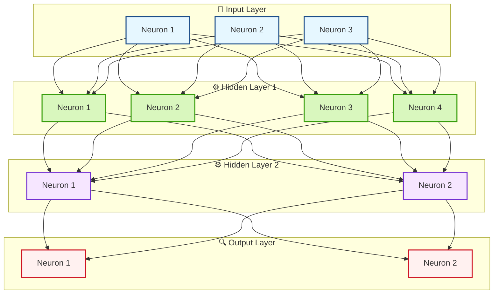

   
[](https://github.com/SermetPekin/microgradCpp/actions/workflows/package.yaml)

# MicrogradCpp

A C++ implementation of [Andrej Karpathy's micrograd](https://github.com/karpathy/micrograd). Small, educational autodiff engine with neural networks. Good for learning how backprop actually works.

## Features

- **Header-only**: Just include the headers, no extra linking needed.
- **Autograd Engine**: A `Value` class that tracks data, gradients, and the computational graph, enabling `loss->backward()` calls.
- **Neural Network Components**:
  - `Linear` layers for building multi-layer perceptrons (MLPs).
  - `MLP` class that stacks `Linear` layers and applies non-linearities (like ReLU).
- **Common Operations**: Basic arithmetic (+, -, *, /, unary negation), `log`, `exp`, `pow`, and more, all differentiable.
- **Loss Functions**: A `Loss::cross_entropy` for classification tasks that integrates smoothly with `softmax` outputs.
- **Optimizers**: A basic `SGD` optimizer to perform parameter updates.
- **Simple Dataset Integration**: An `IrisLoader` utility to load the Iris dataset as an example.

## Getting Started

### Prerequisites

- C++17 compiler (`g++` >= 7.3 or `clang` >= 6.0)
- Iris dataset CSV in `./data/iris.csv`

### Quick Start

```cpp
#include "micrograd.hpp"
using namespace microgradCpp;

int main()
{
    DatasetType dataset = get_iris();
    shuffle(dataset);

    MLP model(4, {10, 10, 3});
    train_eval(dataset, 0.8, model, 0.01, 100);

    return 0;
}
```

### Build

**With Make:**
```bash
make run
```

**With g++:**
```bash
g++ -std=c++17 -Iinclude -O2 -o main main.cpp && ./main
```

**With CMake:**
```bash
mkdir build && cd build && cmake .. && make
```
## Usage

**Create a model:**
```cpp
MLP model(in_features, {hidden1, hidden2, out_features});
```

**Training:** Forward pass → compute loss → `loss->backward()` → `optimizer.step()`

**Operations:** Supports `+`, `-`, `*`, `/`, `log`, `exp`, `pow`

### Examples

We provide four progressively advanced examples:

- **easy.cpp** - Minimal example with in-memory Iris dataset and SGD
- **easy_adam.cpp** - Same as easy.cpp but using Adam optimizer
- **easy_df.cpp** - DataFrame API with CSV loading and data preprocessing
- **main.cpp** - Complete example with DataFrame, Adam, and interactive configuration

See [EXAMPLES.md](EXAMPLES.md) for detailed walkthroughs of each example and when to use them.

## Performance

93% accuracy on Iris dataset (80-20 split)[^1]

[^1]: Fisher, R. (1936). Iris [Dataset]. UCI Machine Learning Repository. https://doi.org/10.24432/C56C76

## Improvements

- Tune hyperparameters (learning rate, epochs, layer sizes)
- Add regularization (dropout, L2 weight decay)
- Try Adam optimizer
- Use k-fold cross-validation
- Feature scaling for other datasets


<details>
  <summary>Example Training Output</summary>

```
Loaded 150 samples from ./data/iris.csv
Epoch 1/100, Loss: 1.10912
Epoch 1: Test Accuracy = 60%
Epoch 2/100, Loss: 0.657723
Epoch 3/100, Loss: 0.590328
Epoch 4/100, Loss: 0.56049
Epoch 5/100, Loss: 0.507944
Epoch 6/100, Loss: 0.517438
Epoch 7/100, Loss: 0.453947
Epoch 8/100, Loss: 0.457171
Epoch 9/100, Loss: 0.43995
Epoch 10/100, Loss: 0.400679
Epoch 11/100, Loss: 0.419943
Epoch 11: Test Accuracy = 63.3333%
Epoch 12/100, Loss: 0.387175
Epoch 13/100, Loss: 0.46077
Epoch 14/100, Loss: 0.353314
Epoch 15/100, Loss: 0.372516
Epoch 16/100, Loss: 0.416995
Epoch 17/100, Loss: 0.372918
Epoch 18/100, Loss: 0.389412
Epoch 19/100, Loss: 0.339006
Epoch 20/100, Loss: 0.376714
Epoch 21/100, Loss: 0.360416
Epoch 21: Test Accuracy = 80%
Epoch 22/100, Loss: 0.333371
Epoch 23/100, Loss: 0.282985
Epoch 24/100, Loss: 0.323401
Epoch 25/100, Loss: 0.333401
Epoch 26/100, Loss: 0.317364
Epoch 27/100, Loss: 0.252736
Epoch 28/100, Loss: 0.278259
Epoch 29/100, Loss: 0.335743
Epoch 30/100, Loss: 0.256701
Epoch 31/100, Loss: 0.385125
Epoch 31: Test Accuracy = 86.6667%
Epoch 32/100, Loss: 0.272716
Epoch 33/100, Loss: 0.320718
Epoch 34/100, Loss: 0.23242
Epoch 35/100, Loss: 0.235965
Epoch 36/100, Loss: 0.336758
Epoch 37/100, Loss: 0.263255
Epoch 38/100, Loss: 0.260777
Epoch 39/100, Loss: 0.216942
Epoch 40/100, Loss: 0.295679
Epoch 41/100, Loss: 0.263334
Epoch 41: Test Accuracy = 83.3333%
Epoch 42/100, Loss: 0.206119
Epoch 43/100, Loss: 0.239363
Epoch 44/100, Loss: 0.217142
Epoch 45/100, Loss: 0.219216
Epoch 46/100, Loss: 0.231273
Epoch 47/100, Loss: 0.236615
Epoch 48/100, Loss: 0.174601
Epoch 49/100, Loss: 0.1995
Epoch 50/100, Loss: 0.248405
Epoch 51/100, Loss: 0.182827
Epoch 51: Test Accuracy = 83.3333%
Epoch 52/100, Loss: 0.255753
Epoch 53/100, Loss: 0.269484
Epoch 54/100, Loss: 0.197941
Epoch 55/100, Loss: 0.231213
Epoch 56/100, Loss: 0.268628
Epoch 57/100, Loss: 0.184304
Epoch 58/100, Loss: 0.257628
Epoch 59/100, Loss: 0.205261
Epoch 60/100, Loss: 0.202221
Epoch 61/100, Loss: 0.218491
Epoch 61: Test Accuracy = 93.3333%
Epoch 62/100, Loss: 0.272666
Epoch 63/100, Loss: 0.206216
Epoch 64/100, Loss: 0.242779
Epoch 65/100, Loss: 0.199603
Epoch 66/100, Loss: 0.159741
Epoch 67/100, Loss: 0.165282
Epoch 68/100, Loss: 0.184907
Epoch 69/100, Loss: 0.144188
Epoch 70/100, Loss: 0.249892
Epoch 71/100, Loss: 0.158859
Epoch 71: Test Accuracy = 93.3333%
Epoch 72/100, Loss: 0.179014
Epoch 73/100, Loss: 0.233659
Epoch 74/100, Loss: 0.174708
Epoch 75/100, Loss: 0.2855
Epoch 76/100, Loss: 0.198777
Epoch 77/100, Loss: 0.176887
Epoch 78/100, Loss: 0.171887
Epoch 79/100, Loss: 0.203625
Epoch 80/100, Loss: 0.228634
Epoch 81/100, Loss: 0.164969
Epoch 81: Test Accuracy = 93.3333%
Epoch 82/100, Loss: 0.213662
Epoch 83/100, Loss: 0.167459
Epoch 84/100, Loss: 0.198857
Epoch 85/100, Loss: 0.227029
Epoch 86/100, Loss: 0.229519
Epoch 87/100, Loss: 0.270876
Epoch 88/100, Loss: 0.178311
Epoch 89/100, Loss: 0.165478
Epoch 90/100, Loss: 0.187928
Epoch 91/100, Loss: 0.146264
Epoch 91: Test Accuracy = 93.3333%
Epoch 92/100, Loss: 0.177392
Epoch 93/100, Loss: 0.228931
Epoch 94/100, Loss: 0.19446
Epoch 95/100, Loss: 0.174602
Epoch 96/100, Loss: 0.143752
Epoch 97/100, Loss: 0.148301
Epoch 98/100, Loss: 0.231661
Epoch 99/100, Loss: 0.179442
Epoch 100/100, Loss: 0.139438
Epoch 100: Test Accuracy = 93.3333%
```

</details>


### Neural Network Architecture

Here is a visual representation of the MLP architecture:

```mermaid
graph TD
    %% Styling for Neurons %%
    classDef inputNeuron fill:#e6f7ff,stroke:#1d4e89,stroke-width:2px
    classDef hiddenNeuron1 fill:#d9f7be,stroke:#389e0d,stroke-width:2px
    classDef hiddenNeuron2 fill:#f6e6ff,stroke:#722ed1,stroke-width:2px
    classDef outputNeuron fill:#fff1f0,stroke:#cf1322,stroke-width:2px

    %% Input Layer %%
    subgraph InputLayer ["🎯 Input Layer"]
        InputNeuron1["Neuron 1"]:::inputNeuron
        InputNeuron2["Neuron 2"]:::inputNeuron
        InputNeuron3["Neuron 3"]:::inputNeuron
    end

    %% Hidden Layer 1 %%
    subgraph HiddenLayer1 ["⚙️ Hidden Layer 1"]
        HiddenNeuron1_1["Neuron 1"]:::hiddenNeuron1
        HiddenNeuron1_2["Neuron 2"]:::hiddenNeuron1
        HiddenNeuron1_3["Neuron 3"]:::hiddenNeuron1
        HiddenNeuron1_4["Neuron 4"]:::hiddenNeuron1
    end

    %% Hidden Layer 2 %%
    subgraph HiddenLayer2 ["⚙️ Hidden Layer 2"]
        HiddenNeuron2_1["Neuron 1"]:::hiddenNeuron2
        HiddenNeuron2_2["Neuron 2"]:::hiddenNeuron2
    end

    %% Output Layer %%
    subgraph OutputLayer ["🔍 Output Layer"]
        OutputNeuron1["Neuron 1"]:::outputNeuron
        OutputNeuron2["Neuron 2"]:::outputNeuron
    end

    %% Connections Between Layers %%
    %% Input Layer to Hidden Layer 1 %%
    InputNeuron1 --> HiddenNeuron1_1
    InputNeuron1 --> HiddenNeuron1_2
    InputNeuron1 --> HiddenNeuron1_3
    InputNeuron1 --> HiddenNeuron1_4

    InputNeuron2 --> HiddenNeuron1_1
    InputNeuron2 --> HiddenNeuron1_2
    InputNeuron2 --> HiddenNeuron1_3
    InputNeuron2 --> HiddenNeuron1_4

    InputNeuron3 --> HiddenNeuron1_1
    InputNeuron3 --> HiddenNeuron1_2
    InputNeuron3 --> HiddenNeuron1_3
    InputNeuron3 --> HiddenNeuron1_4

    %% Hidden Layer 1 to Hidden Layer 2 %%
    HiddenNeuron1_1 --> HiddenNeuron2_1
    HiddenNeuron1_1 --> HiddenNeuron2_2

    HiddenNeuron1_2 --> HiddenNeuron2_1
    HiddenNeuron1_2 --> HiddenNeuron2_2

    HiddenNeuron1_3 --> HiddenNeuron2_1
    HiddenNeuron1_3 --> HiddenNeuron2_2

    HiddenNeuron1_4 --> HiddenNeuron2_1
    HiddenNeuron1_4 --> HiddenNeuron2_2

    %% Hidden Layer 2 to Output Layer %%
    HiddenNeuron2_1 --> OutputNeuron1
    HiddenNeuron2_1 --> OutputNeuron2

    HiddenNeuron2_2 --> OutputNeuron1
    HiddenNeuron2_2 --> OutputNeuron2
```


