   


# MicrogradCpp

**MicrogradCPP** is a C++ library inspired by [Andrej Karpathy’s micrograd](https://github.com/karpathy/micrograd) that provides a small, educational automatic differentiation engine and a simple neural network library on top. It’s geared toward understanding backpropagation, building small neural networks, and experimenting with gradient-based learning—entirely in C++.

This project aims to be easy to read and modify, making it a great learning tool for those who want to understand how automatic differentiation, feed-forward neural networks, and basic optimizers work at a low level.

## Features

- **Header-only**: Just include the headers, no extra linking needed.
- **Autograd Engine**: A `Value` class that tracks data, gradients, and the computational graph, enabling `loss->backward()` calls.
- **Neural Network Components**:
  - `Linear` layers for building multi-layer perceptrons (MLPs).
  - `MLP` class that stacks `Linear` layers and applies non-linearities (like ReLU).
- **Common Operations**: Basic arithmetic (+, -, *, /, unary negation), `log`, `exp`, `pow`, and more, all differentiable.
- **Loss Functions**: A `Loss::cross_entropy` for classification tasks that integrates smoothly with `softmax` outputs.
- **Optimizers**: A basic `SGD` optimizer to perform parameter updates.
- **Simple Dataset Integration**: An `IrisLoader` utility to load the Iris dataset as an example.

## Getting Started

### Prerequisites
- A C++17-compatible compiler (e.g. `g++` >= 7.3, `clang` >= 6.0).
- CMake (optional) if you use the CMake build approach.
- The Iris dataset CSV (`iris.csv`) located in `./data/` directory.


### Building

#### Without CMake (Direct g++ Command)

Since it’s header-only, you just compile `main.cpp`:
```bash
g++ -std=c++17 -Iinclude -O2 -o main main.cpp
```
Run the executable:
```bash
./main
```
If you placed iris.csv in data/, and main.cpp references ./data/iris.csv, ensure you run ./main from the microgradcpp directory.


### 2. Building with Makefile

The project includes a `Makefile` to easily compile and run the code. To build and run the project, follow these steps:

1. **Using `Makefile`:**

   In your project directory, run:
```bash
   make run
```
This will compile your code and automatically run the ./main executable.
### 2. Building with CMake

```bash
mkdir build
cd build
cmake ..
make
```
## Usage

### Defining a Model
To set up a model, just create an instance of the `MLP` class:
```cpp
MLP model(in_features, {hidden1, hidden2, ..., out_features});

````
This defines a network with a given number of input features and any arrangement of hidden layers, ending with your desired output layer size.
Training

    Set up an optimizer like SGD.
    Load your dataset (e.g., Iris) and split it into training and test sets.
    Run the model’s forward pass to get predictions, compute the loss, and then call loss->backward() to perform backpropagation.
    Finally, call optimizer.step() to update the model’s parameters.

Custom Operations

The Value class supports a variety of arithmetic operations (+, -, *, /) and differentiable functions like log, exp, and pow. You can combine these to define custom computations that the model can learn from.
Example with main.cpp

The provided main.cpp script walks you through the entire process. It:

    Loads and preprocesses the Iris dataset.
    Shuffles and splits the data into an 80-20 train-test ratio.
    Defines a simple MLP and trains it with SGD.
    Prints the training loss at each epoch and the test accuracy at regular intervals.

You can experiment directly by tweaking parameters in main.cpp—for example, changing the network architecture, the learning rate, or the number of epochs. Compile and run with:

## Model Performance and Next Steps

I’ve tested the model on the **Iris dataset**[^1] using an **80-20 train-test split**. The model achieved an average **accuracy of 93%** on the test set.


[^1]: Fisher, R. (1936). Iris [Dataset]. UCI Machine Learning Repository. https://doi.org/10.24432/C56C76


 
 ## Ways to Improve the Model

If you want to push beyond the current 93% benchmark on the Iris dataset, consider these tweaks:

- **Hyperparameters**: Adjust the learning rate, add more layers or neurons, or experiment with different numbers of epochs to see if you can squeeze out better performance.
- **Regularization**: If the model’s overfitting, try adding dropout or using weight decay (L2 regularization) to help it generalize.
- **Optimizers**: Sticking to SGD is fine, but you could also try Adam for potentially smoother, faster training.
- **Cross-Validation and Scaling**: K-fold cross-validation can give you a more reliable performance estimate, and feature scaling may help if you’re applying this model to other, more complex datasets.

### What’s Next?

Right now, the model hits about 93% accuracy on Iris, which is a decent starting point. But this setup is flexible—feel free to run it on different datasets, tweak the architecture, or incorporate more advanced techniques as you get comfortable. Each adjustment helps you understand neural networks a bit more and how to tune them for better results.

And credit where it’s due: Thanks to Andrej Karpathy for the original micrograd concept and the helpful video that inspired this C++ version.


<details>
  <summary>example output</summary>

  **Hidden content:**  


example output
```plaintext
Loaded 150 samples from ./data/iris.csv
Epoch 1/100, Loss: 1.10912
Epoch 1: Test Accuracy = 60%
Epoch 2/100, Loss: 0.657723
Epoch 3/100, Loss: 0.590328
Epoch 4/100, Loss: 0.56049
Epoch 5/100, Loss: 0.507944
Epoch 6/100, Loss: 0.517438
Epoch 7/100, Loss: 0.453947
Epoch 8/100, Loss: 0.457171
Epoch 9/100, Loss: 0.43995
Epoch 10/100, Loss: 0.400679
Epoch 11/100, Loss: 0.419943
Epoch 11: Test Accuracy = 63.3333%
Epoch 12/100, Loss: 0.387175
Epoch 13/100, Loss: 0.46077
Epoch 14/100, Loss: 0.353314
Epoch 15/100, Loss: 0.372516
Epoch 16/100, Loss: 0.416995
Epoch 17/100, Loss: 0.372918
Epoch 18/100, Loss: 0.389412
Epoch 19/100, Loss: 0.339006
Epoch 20/100, Loss: 0.376714
Epoch 21/100, Loss: 0.360416
Epoch 21: Test Accuracy = 80%
Epoch 22/100, Loss: 0.333371
Epoch 23/100, Loss: 0.282985
Epoch 24/100, Loss: 0.323401
Epoch 25/100, Loss: 0.333401
Epoch 26/100, Loss: 0.317364
Epoch 27/100, Loss: 0.252736
Epoch 28/100, Loss: 0.278259
Epoch 29/100, Loss: 0.335743
Epoch 30/100, Loss: 0.256701
Epoch 31/100, Loss: 0.385125
Epoch 31: Test Accuracy = 86.6667%
Epoch 32/100, Loss: 0.272716
Epoch 33/100, Loss: 0.320718
Epoch 34/100, Loss: 0.23242
Epoch 35/100, Loss: 0.235965
Epoch 36/100, Loss: 0.336758
Epoch 37/100, Loss: 0.263255
Epoch 38/100, Loss: 0.260777
Epoch 39/100, Loss: 0.216942
Epoch 40/100, Loss: 0.295679
Epoch 41/100, Loss: 0.263334
Epoch 41: Test Accuracy = 83.3333%
Epoch 42/100, Loss: 0.206119
Epoch 43/100, Loss: 0.239363
Epoch 44/100, Loss: 0.217142
Epoch 45/100, Loss: 0.219216
Epoch 46/100, Loss: 0.231273
Epoch 47/100, Loss: 0.236615
Epoch 48/100, Loss: 0.174601
Epoch 49/100, Loss: 0.1995
Epoch 50/100, Loss: 0.248405
Epoch 51/100, Loss: 0.182827
Epoch 51: Test Accuracy = 83.3333%
Epoch 52/100, Loss: 0.255753
Epoch 53/100, Loss: 0.269484
Epoch 54/100, Loss: 0.197941
Epoch 55/100, Loss: 0.231213
Epoch 56/100, Loss: 0.268628
Epoch 57/100, Loss: 0.184304
Epoch 58/100, Loss: 0.257628
Epoch 59/100, Loss: 0.205261
Epoch 60/100, Loss: 0.202221
Epoch 61/100, Loss: 0.218491
Epoch 61: Test Accuracy = 93.3333%
Epoch 62/100, Loss: 0.272666
Epoch 63/100, Loss: 0.206216
Epoch 64/100, Loss: 0.242779
Epoch 65/100, Loss: 0.199603
Epoch 66/100, Loss: 0.159741
Epoch 67/100, Loss: 0.165282
Epoch 68/100, Loss: 0.184907
Epoch 69/100, Loss: 0.144188
Epoch 70/100, Loss: 0.249892
Epoch 71/100, Loss: 0.158859
Epoch 71: Test Accuracy = 93.3333%
Epoch 72/100, Loss: 0.179014
Epoch 73/100, Loss: 0.233659
Epoch 74/100, Loss: 0.174708
Epoch 75/100, Loss: 0.2855
Epoch 76/100, Loss: 0.198777
Epoch 77/100, Loss: 0.176887
Epoch 78/100, Loss: 0.171887
Epoch 79/100, Loss: 0.203625
Epoch 80/100, Loss: 0.228634
Epoch 81/100, Loss: 0.164969
Epoch 81: Test Accuracy = 93.3333%
Epoch 82/100, Loss: 0.213662
Epoch 83/100, Loss: 0.167459
Epoch 84/100, Loss: 0.198857
Epoch 85/100, Loss: 0.227029
Epoch 86/100, Loss: 0.229519
Epoch 87/100, Loss: 0.270876
Epoch 88/100, Loss: 0.178311
Epoch 89/100, Loss: 0.165478
Epoch 90/100, Loss: 0.187928
Epoch 91/100, Loss: 0.146264
Epoch 91: Test Accuracy = 93.3333%
Epoch 92/100, Loss: 0.177392
Epoch 93/100, Loss: 0.228931
Epoch 94/100, Loss: 0.19446
Epoch 95/100, Loss: 0.174602
Epoch 96/100, Loss: 0.143752
Epoch 97/100, Loss: 0.148301
Epoch 98/100, Loss: 0.231661
Epoch 99/100, Loss: 0.179442
Epoch 100/100, Loss: 0.139438
Epoch 100: Test Accuracy = 93.3333%

```
</details>


### Neural Network Architecture

Here is a visual representation of the MLP architecture:

```mermaid
graph TD
    %% Styling for Neurons %%
    classDef inputNeuron fill:#e6f7ff,stroke:#1d4e89,stroke-width:2px
    classDef hiddenNeuron1 fill:#d9f7be,stroke:#389e0d,stroke-width:2px
    classDef hiddenNeuron2 fill:#f6e6ff,stroke:#722ed1,stroke-width:2px
    classDef outputNeuron fill:#fff1f0,stroke:#cf1322,stroke-width:2px

    %% Input Layer %%
    subgraph InputLayer ["🎯 Input Layer"]
        InputNeuron1["Neuron 1"]:::inputNeuron
        InputNeuron2["Neuron 2"]:::inputNeuron
        InputNeuron3["Neuron 3"]:::inputNeuron
    end

    %% Hidden Layer 1 %%
    subgraph HiddenLayer1 ["⚙️ Hidden Layer 1"]
        HiddenNeuron1_1["Neuron 1"]:::hiddenNeuron1
        HiddenNeuron1_2["Neuron 2"]:::hiddenNeuron1
        HiddenNeuron1_3["Neuron 3"]:::hiddenNeuron1
        HiddenNeuron1_4["Neuron 4"]:::hiddenNeuron1
    end

    %% Hidden Layer 2 %%
    subgraph HiddenLayer2 ["⚙️ Hidden Layer 2"]
        HiddenNeuron2_1["Neuron 1"]:::hiddenNeuron2
        HiddenNeuron2_2["Neuron 2"]:::hiddenNeuron2
    end

    %% Output Layer %%
    subgraph OutputLayer ["🔍 Output Layer"]
        OutputNeuron1["Neuron 1"]:::outputNeuron
        OutputNeuron2["Neuron 2"]:::outputNeuron
    end

    %% Connections Between Layers %%
    %% Input Layer to Hidden Layer 1 %%
    InputNeuron1 --> HiddenNeuron1_1
    InputNeuron1 --> HiddenNeuron1_2
    InputNeuron1 --> HiddenNeuron1_3
    InputNeuron1 --> HiddenNeuron1_4

    InputNeuron2 --> HiddenNeuron1_1
    InputNeuron2 --> HiddenNeuron1_2
    InputNeuron2 --> HiddenNeuron1_3
    InputNeuron2 --> HiddenNeuron1_4

    InputNeuron3 --> HiddenNeuron1_1
    InputNeuron3 --> HiddenNeuron1_2
    InputNeuron3 --> HiddenNeuron1_3
    InputNeuron3 --> HiddenNeuron1_4

    %% Hidden Layer 1 to Hidden Layer 2 %%
    HiddenNeuron1_1 --> HiddenNeuron2_1
    HiddenNeuron1_1 --> HiddenNeuron2_2

    HiddenNeuron1_2 --> HiddenNeuron2_1
    HiddenNeuron1_2 --> HiddenNeuron2_2

    HiddenNeuron1_3 --> HiddenNeuron2_1
    HiddenNeuron1_3 --> HiddenNeuron2_2

    HiddenNeuron1_4 --> HiddenNeuron2_1
    HiddenNeuron1_4 --> HiddenNeuron2_2

    %% Hidden Layer 2 to Output Layer %%
    HiddenNeuron2_1 --> OutputNeuron1
    HiddenNeuron2_1 --> OutputNeuron2

    HiddenNeuron2_2 --> OutputNeuron1
    HiddenNeuron2_2 --> OutputNeuron2
```



